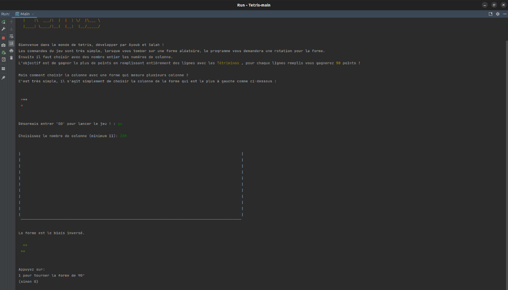

## Lancement du jeu

## Demande de l’écriture correcte du code pour lancer le jeu

## Demande le nombre de colonnes au joueur

## Exemple minimum de colonne

## Exemple avec un nombre plus grand de colonnes en paramètre

## Première forme générée automatiquement

## Placement de la forme dans le cadre

## Placement d’une seconde forme à un autre endroit du cadre et avec sauvegarde de l’ancienne forme

## Placement d’une troisième forme avec collision

## Placement d’une autre forme avec collision

## Placement d’une forme sur une autre partie du cadre avec superposition

## Message de fin de jeu car limite du cadre atteinte + comptabilité des points totaux

## Comptabilité des points lorsque chaque ligne est remplie

## Reset des lignes remplies

## Fin de jeu avec résultats des points lorsqu’il y en a

